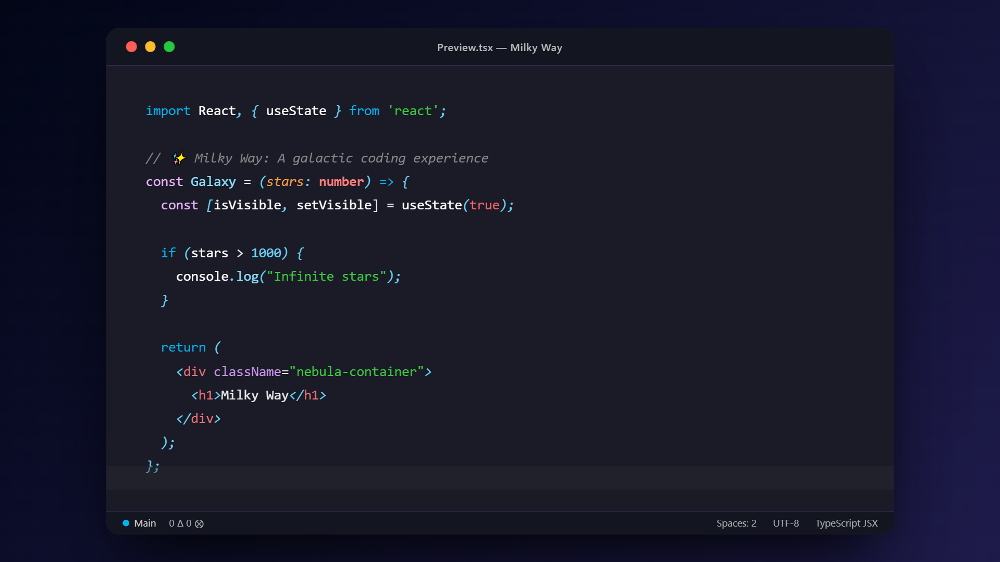

# Milky Way Theme

A beautiful dark theme inspired by the Milky Way, originally created for Monaco Editor and now available for VS Code.

## Installation

1. Open **Extensions** sidebar panel in VS Code. `View → Extensions`
2. Search for `Milky Way`
3. Click **Install** to install it.
4. Click **Reload** to reload your editor.
5. Code > Preferences > Color Theme > **Milky Way**

## Preview

